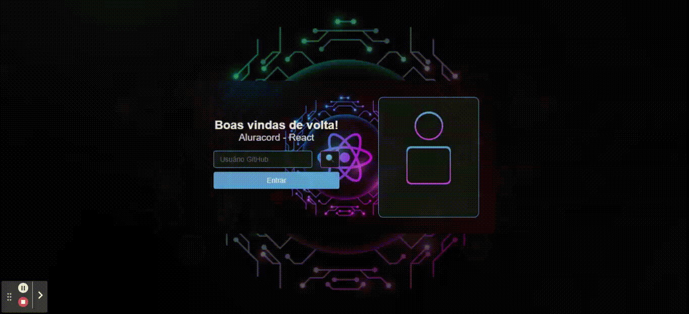
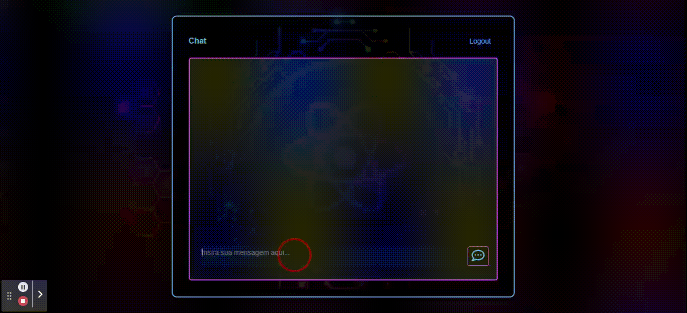

# Aluracord - Projeto Imersão React Alura

## Primeiras impressões.
- Conteúdo didatico incrível, facilmente entendido e aplicado.
- Não exige necessária mente expertise em outras linguagens.
- Comunidade interativa no Discord.
- Profissionais da educação extremamente qualificados.

## Desafio Aula II.
- Pratique mais com o useRouter(), useState() - [X]
- Validação do campo: Só mostrar a imagem se tiver mais de 2 caracteres [X]
Dica: criar uma variável e passar para o botão 
- Desafio Master: Pegar outras informações do usuário batendo na API do GitHub [X]
Dica: você vai usar a função fetch do JavaScript
- Colocar algo divertido na página 404.js da sua pasta pages e compartilhar com a gente no twitter! [ ]

## Desafio Aula III.
- Paulo: Colocar o botão de OK para enviar a mensagem [X]
- Mario: Colocar um botão de apagar mensagem! Dica: use o filter [X]

## Desafio Aula IV.
- Mario Souto: Mostrar o loading de mensagens (Tem que fazer o mais criativo ein!)
- Paulo Silveira: Fazer um efeito quando passar o mouse em cima (Use esse link como referência: https://pt-br.reactjs.org/docs/events.html#mouse-events)

## O projeto até agora.
Página Inicial

Página do Chat
