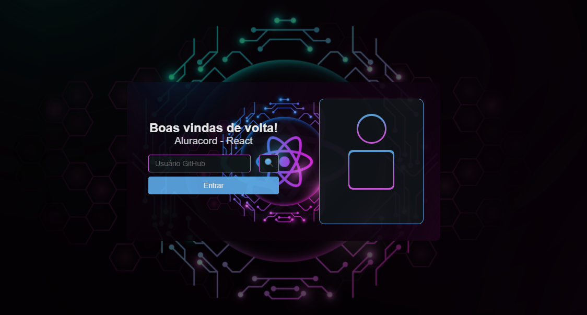

# Aluracord - Projeto Imersão React Alura

## Primeiras impressões.
- Conteúdo didatico incrível, facilmente entendido e aplicado.
- Não exige necessária mente expertise em outras linguagens.
- Comunidade interativa no Discord.
- Profissionais da educação extremamente qualificados.

## Desafio Aula II.
- Pratique mais com o useRouter(), useState()
- Validação do campo: Só mostrar a imagem se tiver mais de 2 caracteres
Dica: criar uma variável e passar para o botão
- Desafio Master: Pegar outras informações do usuário batendo na API do GitHub
Dica: você vai usar a função fetch do JavaScript
- Colocar algo divertido na página 404.js da sua pasta pages e compartilhar com a gente no twitter!

## O projeto até agora.

